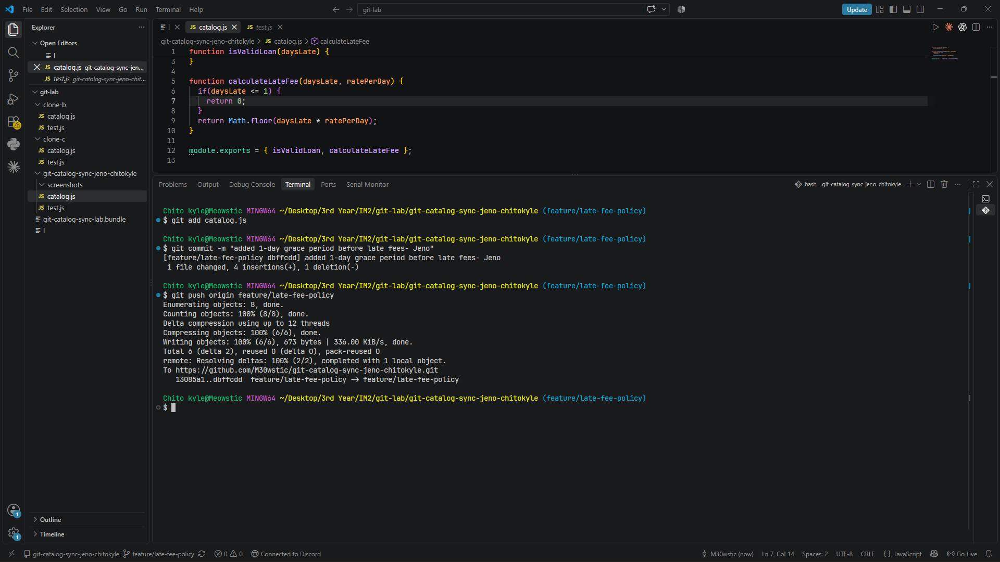
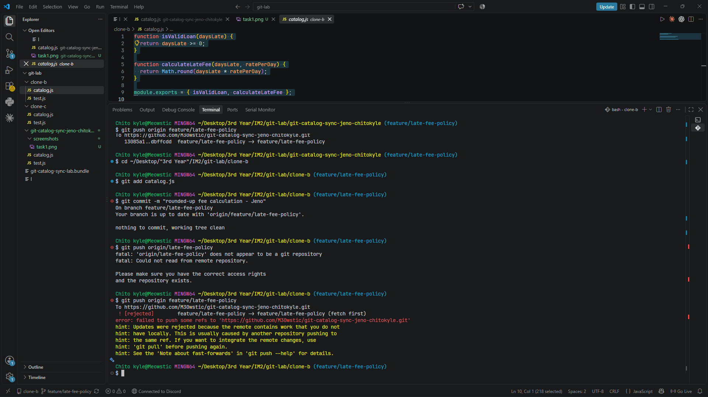
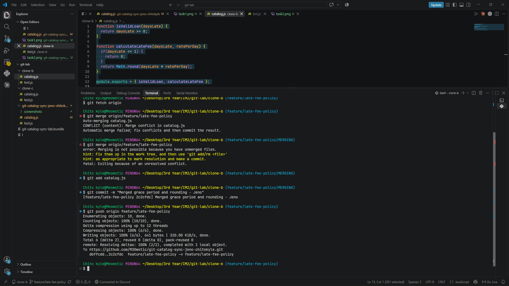
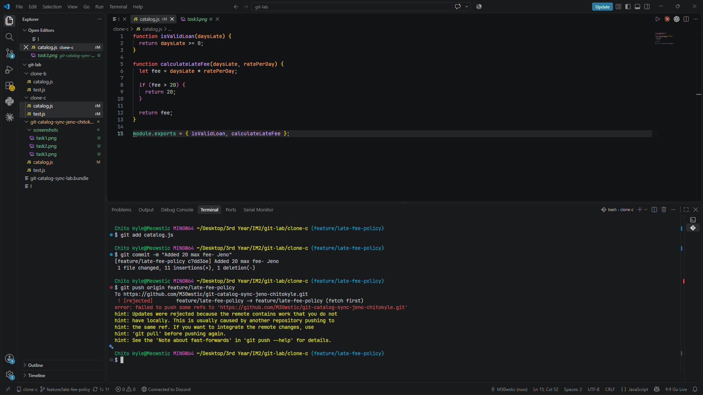
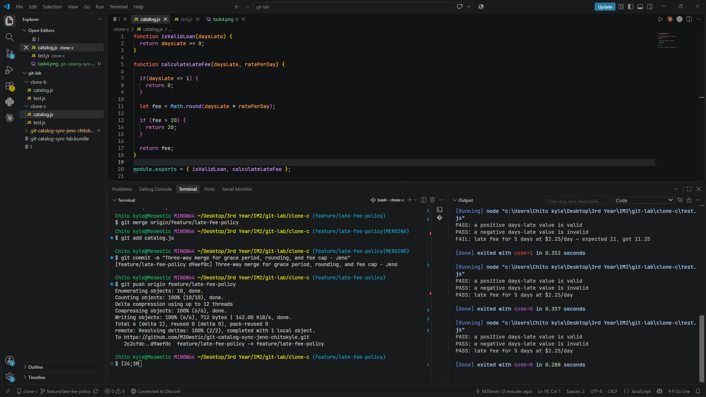
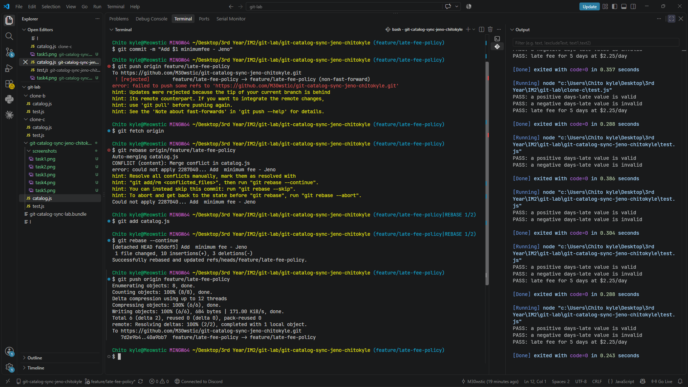
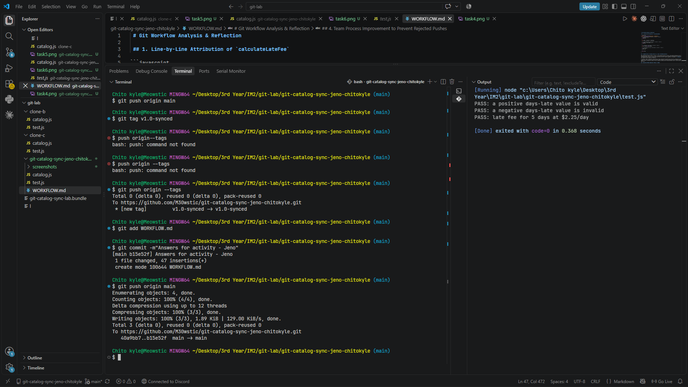

 # Git Workflow Analysis & Reflection

 ## 1. Line-by-Line Attribution of `calculateLateFee`

```javascript
function calculateLateFee(daysLate, ratePerDay) {
  // 1. Grace Period — Contributor 1 (Clone A / Task 1)
  if (daysLate <= 1) {
    return 0;
  }

  let rawFee = daysLate * ratePerDay;

  // 2. $1 Minimum Fee — Contributor 1 (Clone A / Task 6)
  if (rawFee > 0 && rawFee < 1) {
    return 1;
  }

  // 3. Rounding — Contributor 2 (Clone B / Task 2)
  let fee = Math.round(rawFee);

  // 4. $20 Maximum Fee Cap — Contributor 3 (Clone C / Task 4)
  if (fee > 20) {
    fee = 20;
  }

  return fee;
}
```

## 2. Comparing Task 3 (Two-Way Conflict) vs. Task 5 (Three-Way Conflict)

When comparing the merge conflict in Task 3 to the three-way conflict in Task 5, the primary difference lies in the increase in logical complexity when integrating multiple divergent lines of work. In Task 3, resolving the two-way conflict required reconciling only two distinct feature additions—the Grace Period from Task 1 and the Rounding rule from Task 2. Because there were only two sets of logic competing for placement in `catalog.js`, determining code execution order was straightforward and required minimal edge-case evaluation. 

In contrast, Task 5 introduced a third parallel branch containing the $20 Fee Cap from Task 4 alongside the previously merged Grace Period and Rounding rules. Managing a three-way conflict made the resolution process harder because it required evaluating how three separate features interacted with one another. With three concurrent updates, order of operations became critical: applying rounding before checking maximum limits or grace periods could easily result in incorrect financial outputs for edge cases.

## 3. Resolution Method Comparison: Merge vs. Rebase

The key difference between how Task 5 and Task 6 were resolved lies in how Git handles repository history during integration. In Task 5, `git merge` was used to integrate remote changes. This method preserves the exact chronological history of all involved branches by creating a 3-way merge commit that joins the separate branch heads together. 

Task 6, on the other hand, utilized `git fetch origin` followed by `git rebase origin/feature/late-fee-policy`. Instead of joining branch tips with a merge commit, rebasing rewrote the local commit history by detaching the local Task 6 commits, updating the base branch to match the remote tip, and re-applying the local commits directly on top. Resolving conflicts during a rebase fixes code inline on a per-commit basis, resulting in a perfectly linear, sequential commit history that looks as if the new changes were written after all remote work had already taken place.

## 4. Team Process Improvement to Prevent Rejected Pushes

Enforcing a **Pull Request (PR) workflow with feature branches** and requiring developers to **sync locally (`git pull --rebase`)** before pushing.

In the lab exercise, Push rejections happened because multiple people tried pushing directly to the same remote branch without pulling the latest changes first. To prevent this, the team should use short-lived feature branches and Pull Requests instead of pushing directly to shared branches. Apart from that, adopting a policy where developers always run `git fetch` and rebase their local branch before pushing ensures every push goes through cleanly without rejection.

## Screenshot Evidence






